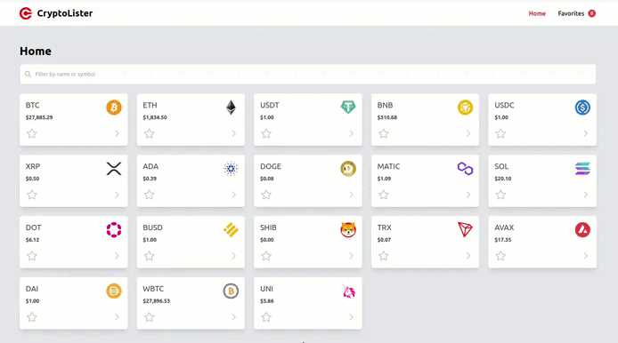
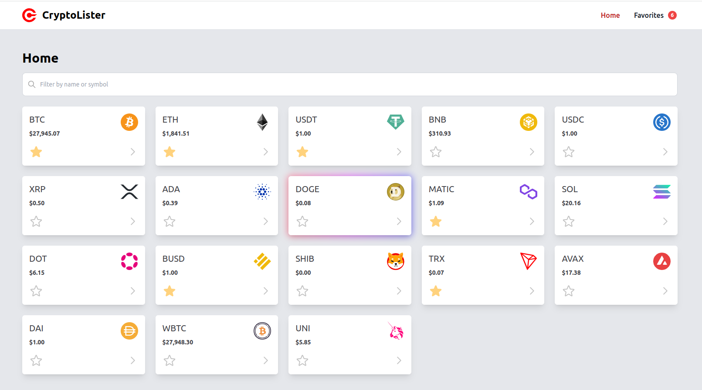
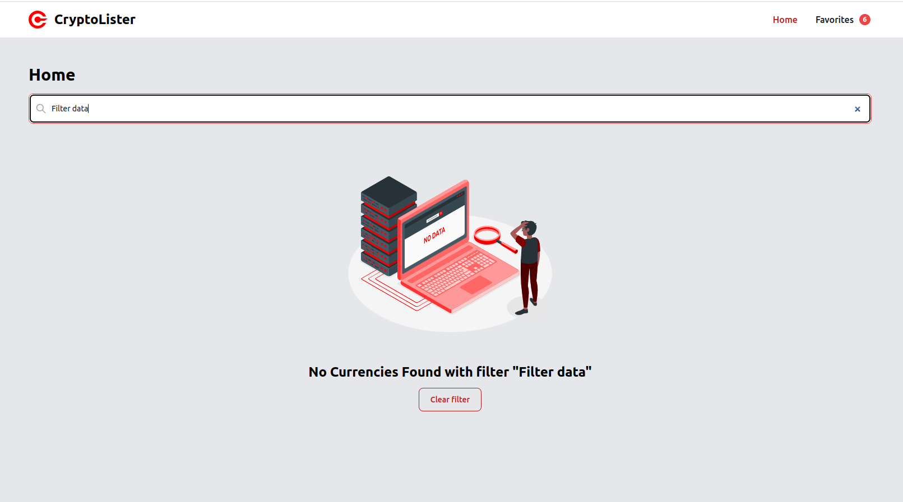
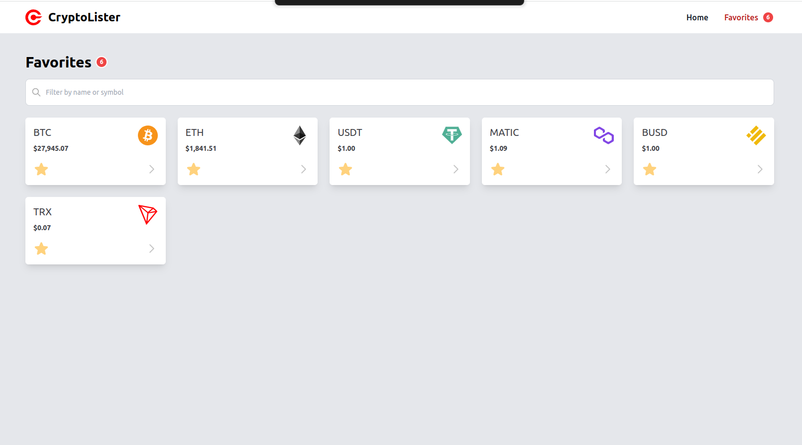
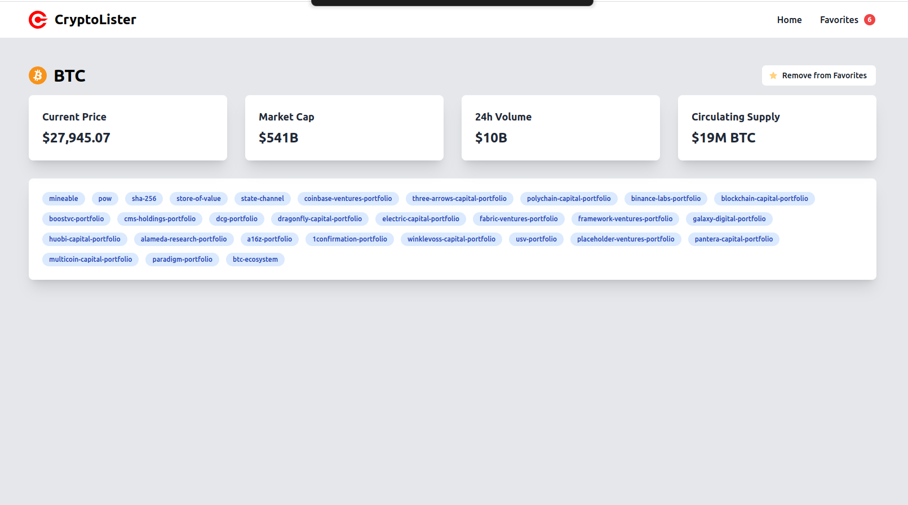

<h3 align="center">CryptoLister</h3>

Explore the world of cryptocurrencies with this innovative demo application. Effortlessly browse, preview and choose your favorite cryptocurrencies!

 

<h1 align="center"><a href="https://crypto-loader-nuxt.netlify.app/">Live Demo</a></h1>

# About

This project serves as a testament to my proficiency as both a front-end and full-stack web developer. It demonstrates my expertise in various technologies and showcases my ability to create polished and functional web applications.

You can contact me at [belov.yanko@gmail.com](mailto:belov.yanko@gmail.com).

## Technologies Used

This project was built using the following technologies:

- **Nuxt.js**
- **Vue.js**
- **Pinia**
- **TypeScript**
- **JavaScript**
- **Node.js**
- **Tailwind**
- **Vite**
- **Cypress**
- **Vitest**
- **ESLint**
- **Prettier**
- **StyleLint**

## Installation

To run this project locally, you will need to follow these steps:

1. Clone this repository to your local machine.
2. Install the required dependencies by running `npm install`.
3. Copy the `.env.example` file to `.env`
4. Go to [CoinMarketCap API](https://coinmarketcap.com/api/) and create an account. Then, create a new API key and copy it to the `VITE_NUXT_CRYPTO_API_KEY` variable in the `.env` file. 
5. Start the development server by running `npm run dev`.
6. Open your browser and navigate to http://localhost:3000.

## Testing

This project includes the following tests:

- End-to-end (e2e) tests using Cypress 
- Unit tests using Vitest 

### Run Unit Tests

`npm run test:unit`

### Run e2e Tests

`npm run test:e2e`

### Code Coverage

`npm run test:coverage`

## Screenshots

Here are some screenshots of the project:

